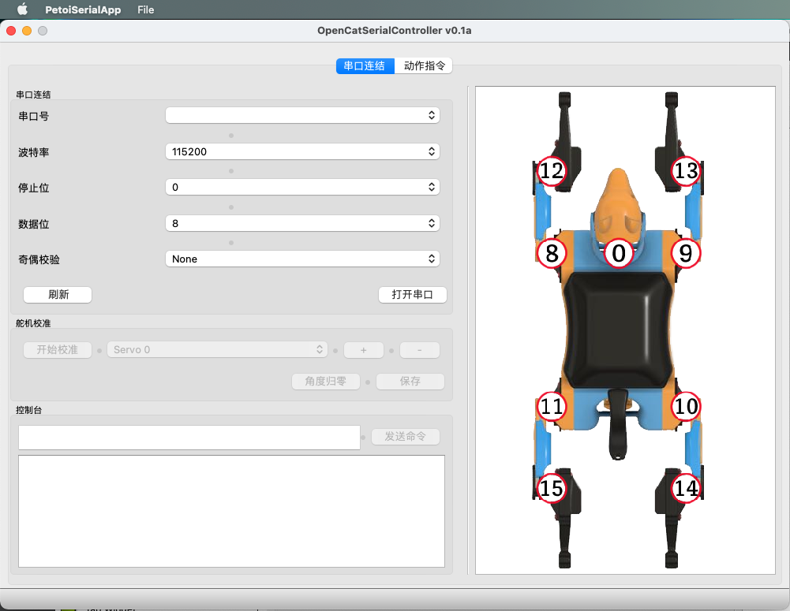
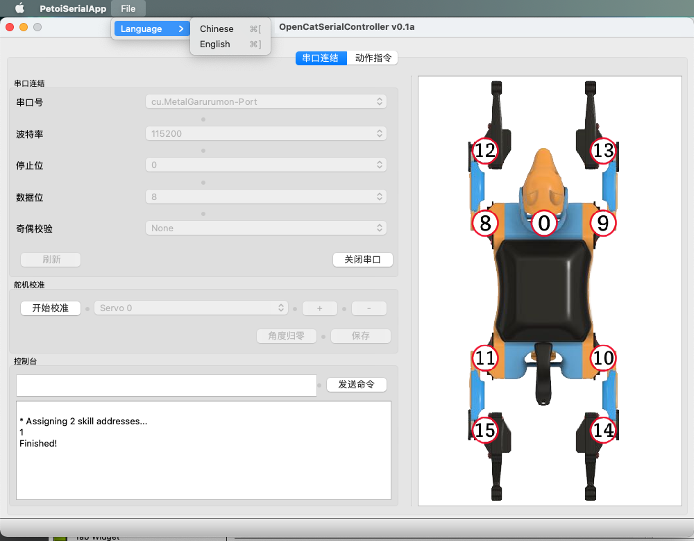
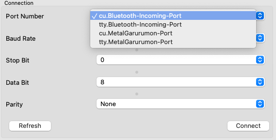
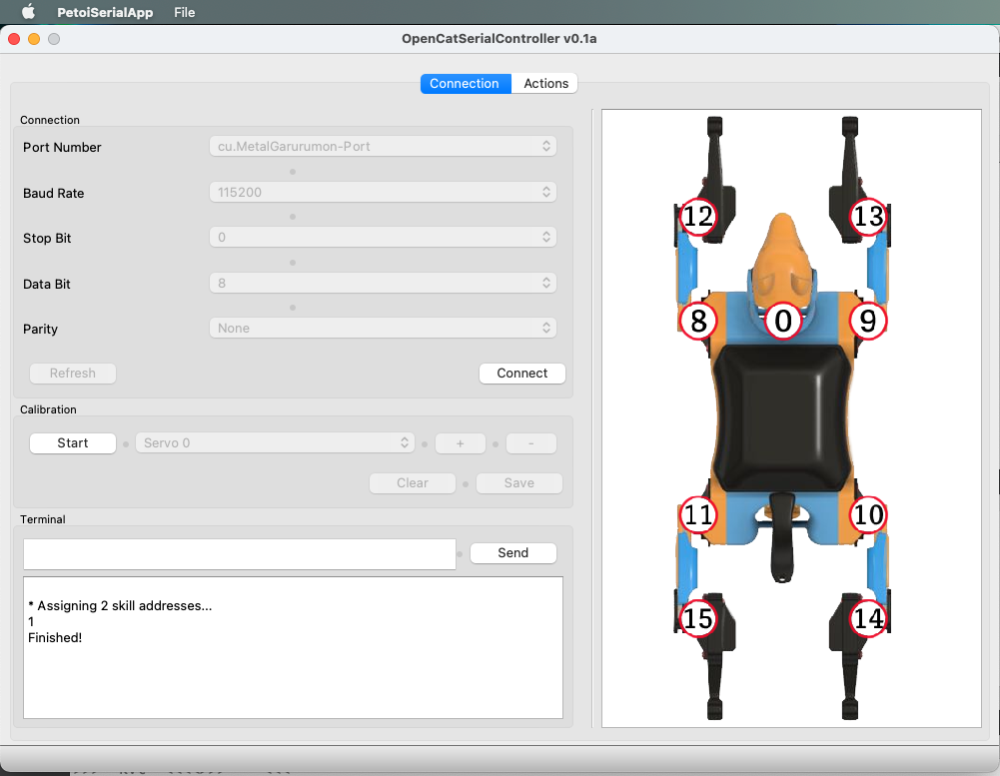
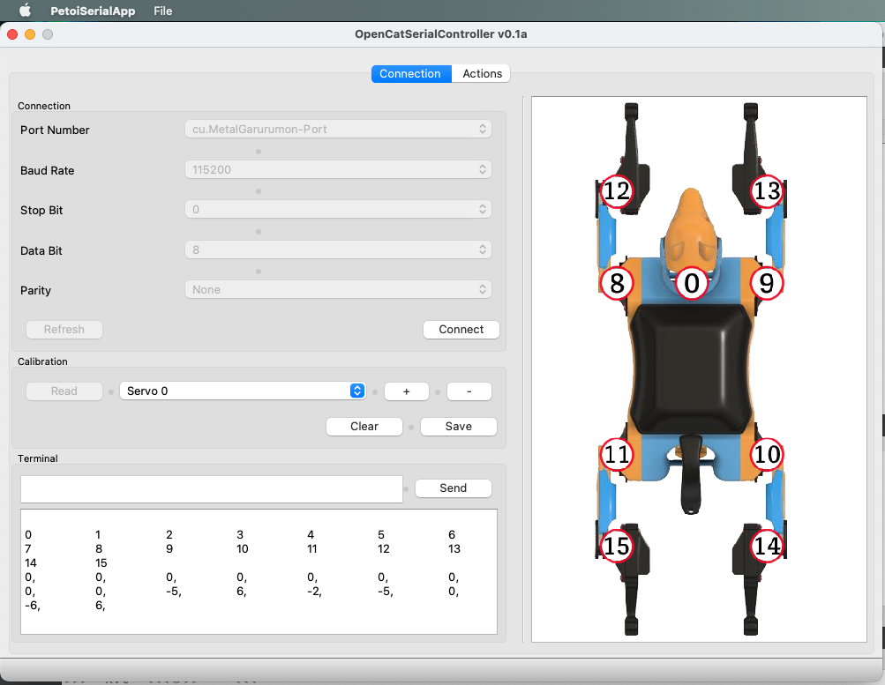
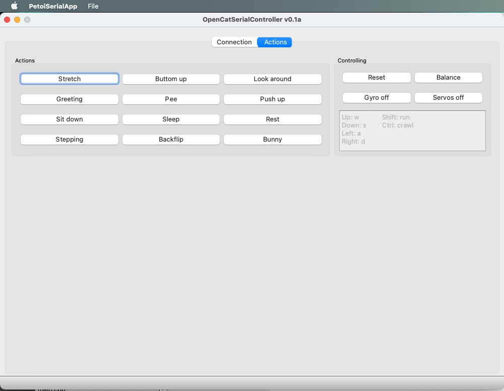

# What's this?

This is a serial controller for Petoi's devices such as Bittle. 

This project was written with Qt5, therefore you can easily deploy it on your PC (Windows/MacOS/Linux).

# What could it do?

After you build the application on your PC, you will be able to control the robot, such as calibrating the servos of Bittle, and triggering some skills, such as running, jumping, walking, etc.

This project extends the functionality and user interaction of Bittle. It can also serve as a demo for developers who wants to fully explore Bittle's possibilities. 

# Are there any third-party libraries required?

Only Qt5 is needed. No need to install any third-party libraries. You can clone this repository and build it on your local machine.

**Qt Official Website**

https://www.qt.io/

**Getting start with Qt**

https://resources.qt.io/development-topic-getting-started-with-qt

# Instructions on the current UI

## Change Language

The default interface is in Chinese.

You can switch to English by clicking **File/Language/English** from the menu.

## Connect to Bittle

Before playing with Bittle, you need to correctly plug the Bluetooth module or USB module to the 6-pin socket on the NyBoard. The LED on the module will turn on after inserted into the 6-pin socket. 

Click the **Refresh** button, let the app search the available serial ports on your PC.

After 1~2 seconds, you will see a list of the available **Serial Ports**.

The other configurations, such as baud rate, stop bits, data bits and parity should remain default. You don't need to modify their values. 

### **For MacOS user:**

**USB Serial**

You can connect Bittle with the USB serial module. Plug the USB module to Bittle, and connect it to your PC through the USB cable. Click the **Refresh** button,  and a port called "usbserialXXXX" should appear in the Port Number drop menu.

**Bluetooth**

When Bittle starts up, the LED on the module should blink, meaning it's ready for connection. Find the device in your computer's Bluetooth setting, and enter 0000 (or 1234) as the pin code. The LED should go steady. After that, click the **Refresh** button. Something named like "cu.PetoiSerial" should appear in the  Port Number drop menu.

### **For Windows user:**

Whether you use the USB module or the Bluetooth module, the items in the "Port Number" list are named as "COM#". You have to test each COM port from the list and click **Connect** to validate. You can also unplug the module and check which port disappeared. Then you will know the corresponding COM number. 

After connecting to the port, the main program will reset and play the booting music. Some message will be printed in the textbox, meaning you have successly connected to Bittle.

## Calibration

Before you play with Bittle, one important thing you have to do is calibration.

Click the **Start** button to enter the Calibration mode. The app needs a few seconds to communicate with Bittle and get its servos' calibration angles.

After you've seen the output as shown in the above picture, you need to click the **Read** button to get the saved calibration values from Bittle.

Make sure every servo is in the right position. You can use the L- shaped ruler to help you calibrate. The servos on Bittle are indexed as shown on the right side of this app.

After calibrating all the servos, remember to click the **Save** button to save the updated angles and the app will synchronize with Bittle.

## Play with Bittle

You only need to calibrate Bittle for once. Next time, you can just click the **Action** tab.

Now you can play with Bittle with actions show above.

## Play more!

Want to control Bittle like a remote controlled car?

forward: w

backward: s

turn left: a

turn right: d

run-forward: shift + w

run-left: shift + a

run-right: shift + d

crawl forward: ctrl + w

crawl left: ctrl + a

crawl right: ctrl + d

Too slow?

Click the **Gyro off** button, and see what happens? 
